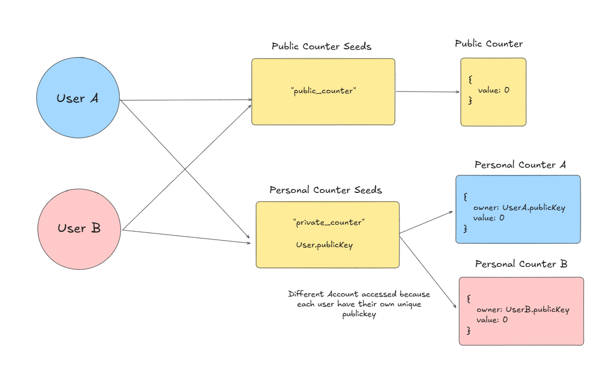

# Solana Counter Example

This is an example program of a counter program on Solana.

Here are the files to check:
- `programs/counter/lib.rs`: Solana Program Implementation
- `tests/counter.ts`: Testcase to call the program
- `Anchor.toml`: File to modify if you want to test the program on Solana Devnet
- `app`: Frontend App to test your program

## Overview

This code is a default template for any developers to start building a Solana Program.

Using a simple Counter implementation, you will explore the basic level of how a Solana Program works by learning how a function is called and how an account is created on Solana.

## What to Learn

1. Creating a Function Call
2. Creating Account on Solana
3. Initializing an Account
4. Creating Unique Account Addresses
5. Creating an Error Message

## Usage & Development

The Smart Contract has been deployed to **Solana Devnet** with the address: `Hx8vRhUw1Rg7nSRp7dEkpXTpwpuKFJCdHcEqinsgRKjy`. Anyone can interact using this Solana Program to test it out.

Open [SETUP.MD](./SETUP.MD) for more details on how to deploy or use the Solana Program

## Sanity Check
- `"Account"`: the way data is stored in Solana, which has a unique address, and a storage data. Everything on Solana is an Account (including your wallet, smart contract, tokens, NFTs, etc)

- `"Solana Program"`: also known as "Smart Contract" (we don't use that in Solana), Solana Program is the code that we're writing today which will be deployed to Solana Network.


## 1. Creating a Function Call 
In the program code, we initialized two functions: `add_public` and `add_personal`. This function will add a value of one to the counter's data.

Note that a function in Solana needs two part:

**- The function call**
Similar to how a function works, you need to specify the functions and the logic:
```rust
// This is an example function on Solana
pub fn add_public(ctx: Context<AddPublic>)->Result<()>{
    let public_counter = &mut ctx.accounts.public_counter;
    // Add a Transaction Message
    msg!("Public Counter Value for added to {}", public_counter.value);
    // Add the counter value by 1
    public_counter.value += 1;
    Ok(())
}
```
This function will print a message during the transaction, and also increase the value of `counter` by one.


**- The Account Context**
An extra additional step is that you need to add an account context structure to pass in all the accounts that's needed in the transaction:
```rust
// This is an Account Context for the add_public() function
#[derive(Accounts)]
pub struct AddPublic<'info> {
    #[account(
        init_if_needed, 
        payer = user, 
        space = PublicCounter::LEN,
        seeds=[b"public_counter".as_ref()],
        bump,
    )]
    pub public_counter: Account<'info, PublicCounter>,
    #[account(mut)]
    pub user: Signer<'info>,
    pub system_program: Program<'info, System>,
}
```

More details will be covered in next steps. But here, you will need to pass in **3 accounts**, which are `public_counter`, `user`, and `system_program` in the account context.

## 2. Creating Account on Solana

This is an example of a Solana Account called `PersonalCounter` that holds two value, a `Pubkey` and a `u64` number. The account stores the PublicKey/Address of the owner that's authorized to change the Counter's value

```rust
// This is an Account in Solana
#[account]
pub struct PersonalCounter {
    pub owner: Pubkey,
    pub value: u64,
}
impl PublicCounter{
    pub const LEN: usize = 8 + 32 + 8; // discriminator + Pubkey + u64
}
```

`LEN` is the default **length/memory size** of the account, consisting of:
- **8 bytes**: Discriminator (required in every Solana Account)
- **32 bytess**: Public Key
- **8 bytes**: u64

## 3. Initializing an Account

Once you define the account, you can start creating it when calling your Solana Program. There's two approach to do this. One is by using `init` or `init_if_needed`

- `init`: Initialize a new account when the transaction is called. If the account has been created, the transaction will fail
- `init_if_needed`: Initialize a new account only if the account has not been created.

**Example Usage:**

This account context *(discussed in topic 1)* initializes a `PublicCounter` account if it hasn't existed.
```rust
#[derive(Accounts)]
pub struct AddPublic<'info> {
    #[account(
        init_if_needed, 
        payer = user, 
        space = PublicCounter::LEN,
        seeds=[b"public_counter".as_ref()],
        bump,
    )]
    pub public_counter: Account<'info, PublicCounter>,

    #[account(mut)]
    pub user: Signer<'info>,
    pub system_program: Program<'info, System>,
}
```
Note that:
- `user`: the address that Sign the transaction who will pay for the fee to initialize the account
- `space`: the memory size allocated for the account (the transaction will fail if not enough memory is allocated)
- `seeds`: unique identifier of the account inside the Solana Program (discussed in next step)
- `bump`: not important yet, but you still need to include it if you specify the `seeds`

If you want to use `init_if_needed`, make sure the **feature** has been included in the dependencies at `progarms/counter/Cargo.toml`
```rust
[dependencies]
anchor-lang = { version = "0.30.1", features = ["init-if-needed"] }
```

## 4. Creating Unique Account Addresses

**Every account in Solana needs a unique address** (e.g. my wallet address is different to your wallet address)

Hence, there will be scenarios when you need to make each account initialized in your Solana Program **UNIQUE** by passing the **seeds**. For example, to store the user data in your program, you need to initialize a unique address for each individual users.

You can see the example in `AddPersonal` context where each wallet which pass in `user.key()` (the public key of the signer) as one of the seeds. This make sure each user will receive a unique `PersonalCounter` account addresses as each user has their own unique address. 
```rust
// Example of seeds that generate one same address for every user
seeds=[b"public_counter".as_ref()],
```
```rust
// Example of seeds that generate multiple different addresseses for each user
seeds=[b"personal_counter".as_ref(), user.key().as_ref()],
```




## 5. Creating an Error Message
In the code, we also initializes custom error messages that can be passed inside your Solana Program. This will be used inside to **STOP/REVERT** your transaction.

When a transaction is reverted, a user will not be able to add the transaction to the network.

Example Solana Program Error Codes:
```rust
#[error_code]
pub enum Errors {
    #[msg("Invalid owner")]
    InvalidOwner,

    #[msg("My Error Message")]
    MyErrorMessage,

    // Add More Error Messages here
}
```

How to implement it in your program:

```rust
// This code will raise the InvalidOwner error if the checking fails
require!(public_counter.owner == ctx.accounts.user.key(), Errors::InvalidOwner);
```

Hence, using this error code, we implement a **check** feature in the `add_personal` function, to make sure that signer/caller of the transaction is the owner of the `PersonalCounter` Account that's passed in the account context. 

If it's not, then the `require!` function will raise the `InvalidOwner` Error Message and stops the transaction.